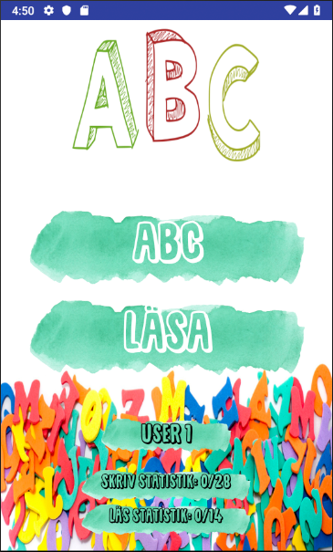
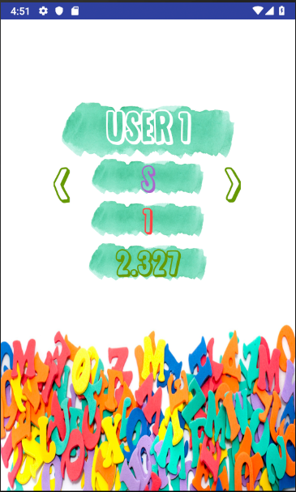
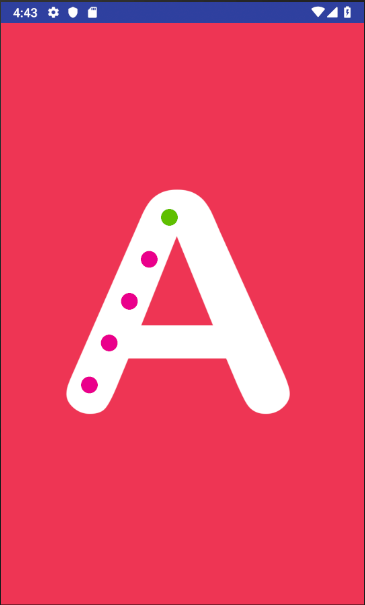
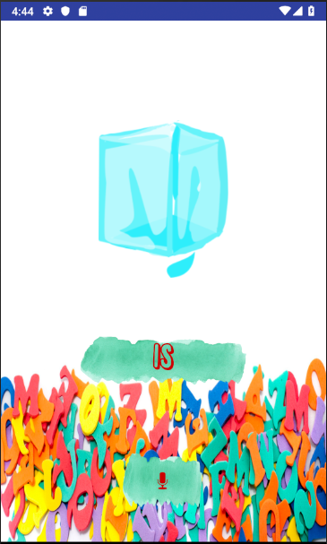

# ABC

## Project information
```
IDE: Android Studio
Programming language: Java
```

## Description
```
Android smartphone application developed for kids to learn the alphabet and pronounciation of easy words in Swedish. 
The development group included four students and was developed during the course Software Engineering at Högskolan Kristianstad. 
```

## Learning outcomes
```
*Android studio enviroment / activity lifecycles 
*Local MySQL Database
*Android Text-to-speech
*Android Speech-to-text
*Android Background services
```

# Home activity & Alphabet game statistics

# Alphabet game & Pronunciation game



